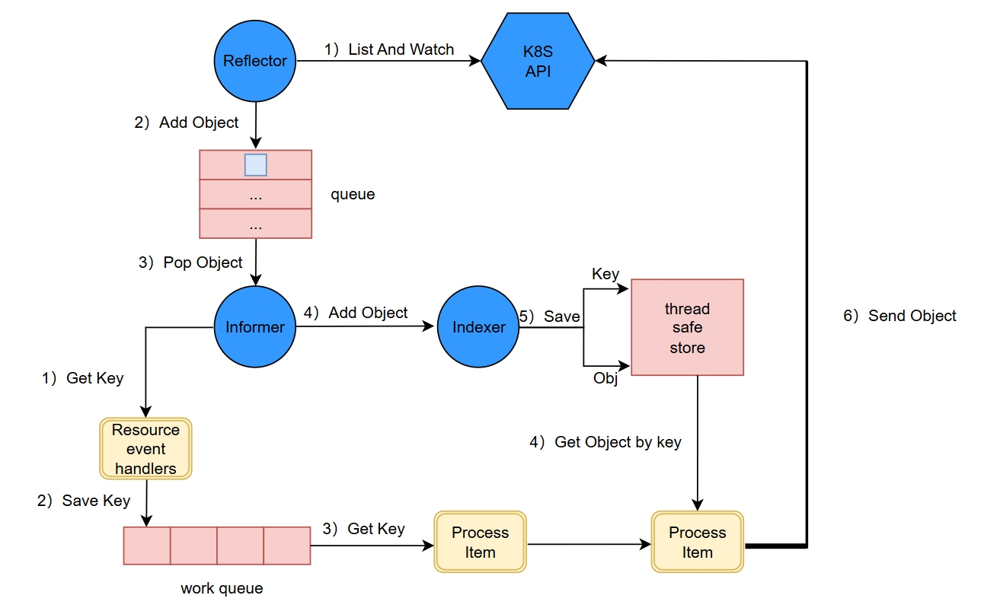

# Controllers

目前实现了Pod Controller 和Crd Controller监视k8s的两种资源

##  逻辑



##  Controller结构

```go
type Controller struct {
	Name     string
	indexer  cache.Indexer
	queue    workqueue.RateLimitingInterface
	informer cache.Controller
	client   client.IClient
}
```

```go
type IClient interface{}
//空接口，用于接收客户端参数
```


##  创建Pod Controller实例

```go
func NewPodController() *Controller {
	clientSet := client.NewClientSet()

	queue := workqueue.NewRateLimitingQueue(workqueue.DefaultControllerRateLimiter()) //创建队列

	podListWatcher := cache.NewListWatchFromClient(clientSet.CoreV1().RESTClient(), "pods", "default", fields.Everything())
	indexer, informer := cache.NewIndexerInformer(podListWatcher, &corev1.Pod{}, 0, cache.ResourceEventHandlerFuncs{ //创建indexer和informer
		AddFunc: func(obj interface{}) {
			key, err := cache.MetaNamespaceKeyFunc(obj)
			fmt.Printf("加入pod:%s\n", key) //拿到key
			if err == nil {
				queue.Add(key)
			}
		},
		UpdateFunc: func(oldObj, newObj interface{}) {
			key, err := cache.MetaNamespaceKeyFunc(newObj)
			fmt.Printf("更新queue:%s\n", key)
			if err == nil {
				queue.Add(key)
			}
		},
		DeleteFunc: func(obj interface{}) {
			key, err := cache.DeletionHandlingMetaNamespaceKeyFunc(obj)
			fmt.Printf("删除pod:%s\n", key)
			if err == nil {
				queue.Add(key)
			}
		},
	}, cache.Indexers{})
	return &PodController{
		indexer:  indexer,
		queue:    queue,
		informer: informer,
		client:   clientSet,
	}
}
```

##  创建Crd Controller 需要自定义ListWatch方法

```go
func newListWatchForDynamicClient(dynamicClient dynamic.Interface, gvr schema.GroupVersionResource, namespace string) *cache.ListWatch {
	return &cache.ListWatch{
		ListFunc: func(options metav1.ListOptions) (runtime.Object, error) {
			obj, err := dynamicClient.Resource(crd).Namespace("default").List(context.TODO(), metav1.ListOptions{})
			if err != nil {
				return nil, err
			}
			return obj, nil
		},
		WatchFunc: func(options metav1.ListOptions) (watch.Interface, error) {
			watchInterface, err := dynamicClient.Resource(gvr).Namespace(namespace).Watch(context.TODO(), metav1.ListOptions{})
			if err != nil {
				return nil, err
			}
			return watchInterface, nil
		},
	}
}
```

